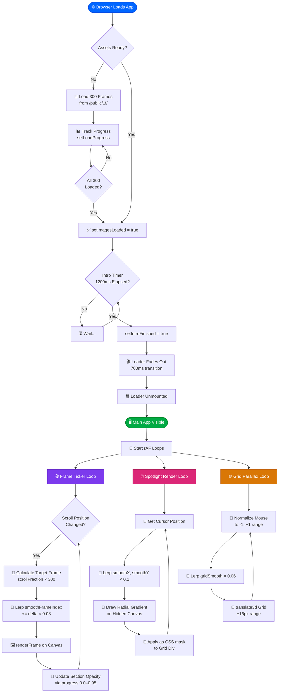
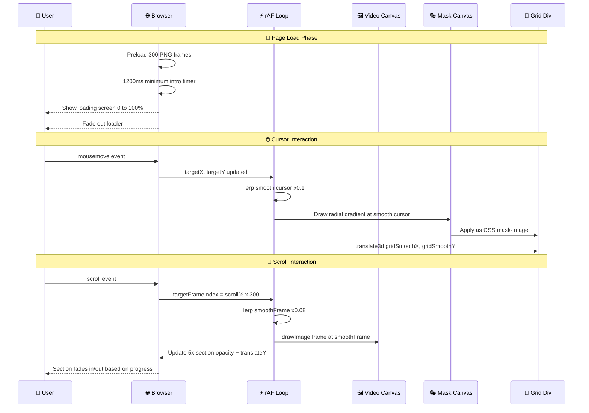
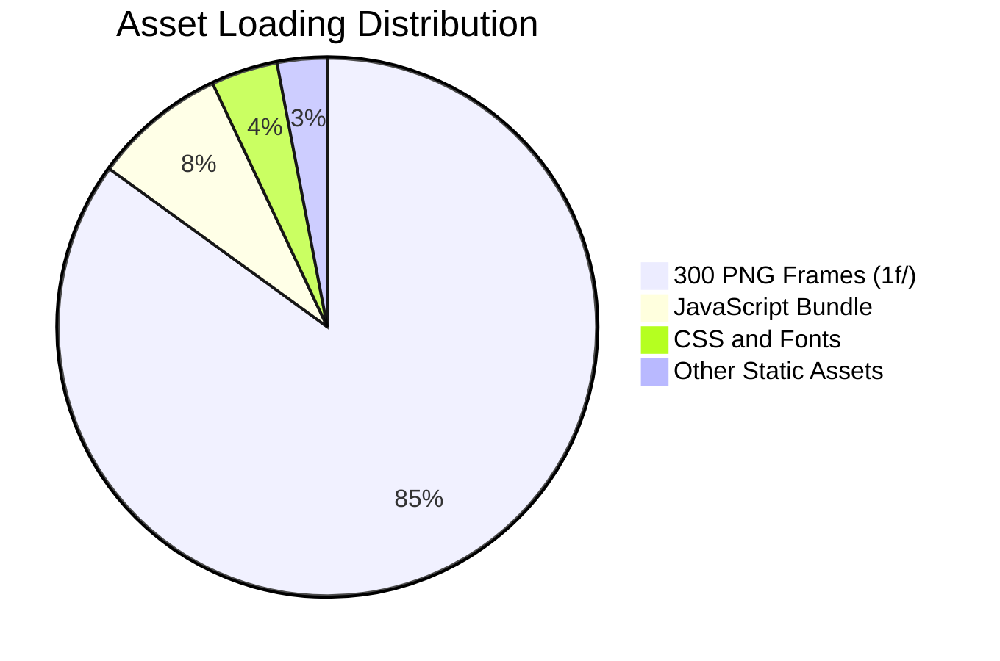
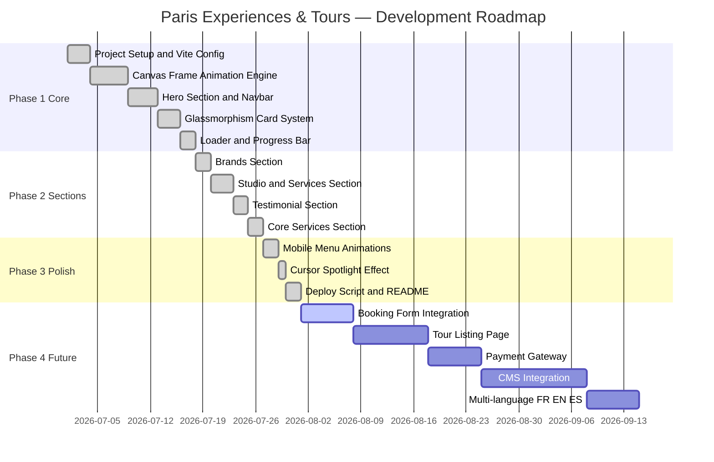

<div align="center">

<!-- Animated Header Banner -->


<!-- Badges Row 1 -->
[](https://reactjs.org/)
[](https://www.typescriptlang.org/)
[](https://vitejs.dev/)
[](https://tailwindcss.com/)

<!-- Badges Row 2 -->
[](./LICENSE)
[]()
[]()
[]()

<br/>

> ### 🌟 *"From iconic landmarks to hidden cafés — we create journeys that feel effortless and memorable."*

<br/>

<!-- Animated typing SVG -->


</div>

---

## 📑 Table of Contents

<details open>
<summary><b>🗂️ Click to expand / collapse</b></summary>

- [🌍 Project Overview](#-project-overview)
- [✨ Key Features](#-key-features)
- [🏗️ Architecture Overview](#️-architecture-overview)
- [📊 Tech Stack Chart](#-tech-stack-chart)
- [🔄 Application Flowchart](#-application-flowchart)
- [🎬 Animation Pipeline Sequence Diagram](#-animation-pipeline-sequence-diagram)
- [📐 Section Breakdown](#-section-breakdown)
- [📁 Project Structure](#-project-structure)
- [🚀 Getting Started](#-getting-started)
- [⚙️ Configuration](#️-configuration)
- [🎨 Design System](#-design-system)
- [📈 Performance & Load Strategy](#-performance--load-strategy)
- [🗺️ Roadmap](#️-roadmap)
- [🤝 Contributing](#-contributing)
- [🛡️ Browser Support](#️-browser-support)
- [📄 License](#-license)

</details>

---

## 🌍 Project Overview

<div align="center">

```
╔══════════════════════════════════════════════════════════════╗
║         🗼 PARIS EXPERIENCES & TOURS — v1.0.0               ║
║                                                              ║
║  A cinematic, scroll-driven luxury travel platform built    ║
║  with React 19 + Vite + TypeScript + TailwindCSS v4         ║
║                                                              ║
║  🎯 Goal: Transport visitors to Paris before they arrive    ║
╚══════════════════════════════════════════════════════════════╝
```

</div>

**Paris Experiences & Tours** is a premium, full-screen cinematic web experience that uses **scroll-linked frame animation** to bring Paris to life. As users scroll through the page, **300 sequential image frames** play back like a movie — all synchronized with five immersive content overlays that fade in and out using GPU-accelerated transforms.

| 🏷️ Attribute | 📝 Detail |
|---|---|
| 🎯 **Purpose** | Premium travel booking & showcase platform |
| 🌐 **Domain** | Luxury Paris tourism & experiences |
| 🎨 **Design Style** | Dark glassmorphism + spotlight cursor effects |
| 📱 **Responsive** | Mobile-first, scales to 4K displays |
| ⚡ **Framework** | React 19 + Vite 8 + TypeScript |
| 🎬 **Animation** | Canvas-based scroll-linked frame sequence |
| 🖱️ **Interactivity** | Cursor spotlight, parallax grid, hover effects |

---

## ✨ Key Features

<div align="center">

```
┌─────────────────────────────────────────────────────────────┐
│                    🌟 FEATURE HIGHLIGHTS                    │
│                                                             │
│  🎬  Scroll-Linked      📱  Mobile         🖱️  Cursor       │
│      Frame Animation        First Design      Spotlight     │
│                                                             │
│  🌙  Dark Mode          ✨  Glassmorphism  ⚡  Vite HMR     │
│      Native                 Cards             Dev Server    │
│                                                             │
│  🔄  Smooth Lerp        📊  5 Animated     🌍  Multi-       │
│      Transitions            Sections          Section UI    │
└─────────────────────────────────────────────────────────────┘
```

</div>

- 🎬 **300-Frame Cinematic Scroll Animation** — Image sequence synced to scroll, played on `<canvas>` with lerp interpolation
- 🖱️ **Cursor Spotlight Effect** — Radial gradient mask follows cursor, revealing lit grid underneath
- 🌊 **Parallax Grid Background** — Background grid shifts subtly on cursor movement for depth
- 🪟 **Glassmorphism Cards** — `backdrop-filter: blur` + translucent backgrounds + soft border glow
- 📝 **5 Scroll-Pinned Sections** — Hero, Brands, Services, Testimonial, Core Services with fade transitions
- 🔢 **Asset Preloading with Progress Bar** — 300 frames preloaded with beautiful full-screen loader
- 📱 **Responsive Mobile Menu** — Glassmorphism dropdown drawer with animated slide-up items
- 🇫🇷 **French Flag Badge** — SVG-rendered tricolor badge in the navbar
- 📐 **Cover-fit Canvas Rendering** — Smart aspect ratio fills any screen size

---

## 🏗️ Architecture Overview

```
┌──────────────────────────────────────────────────────────────────┐
│                    CLIENT-SIDE ARCHITECTURE                      │
│                                                                  │
│   Browser Window                                                 │
│   ├── 🔲 Fixed UI Layer                                         │
│   │   ├── 📺 Scroll Canvas     [z: -1]  — Background video     │
│   │   ├── 🌐 Hidden Mask Canvas [hidden] — Spotlight mask data  │
│   │   └── 🗂️ Section Container  [fixed] — 5 overlapping panels │
│   │       ├── Section 1: Hero Banner      (scroll 0–15%)        │
│   │       ├── Section 2: Trusted Brands   (scroll 20–35%)       │
│   │       ├── Section 3: Studio / Cards   (scroll 40–55%)       │
│   │       ├── Section 4: Testimonial      (scroll 60–75%)       │
│   │       └── Section 5: Core Services   (scroll 80–95%)       │
│   │                                                              │
│   └── 📜 Scroll Container [500vh] — Drives animation            │
│                                                                  │
│   Three Animation Loops (requestAnimationFrame)                 │
│   ├── 🎬 Frame Ticker      — lerp scrollFrame → renderFrame     │
│   ├── 🖱️ Spotlight Render  — lerp mouse → canvas mask           │
│   └── 🌐 Grid Parallax     — lerp mouse → grid translate3d      │
└──────────────────────────────────────────────────────────────────┘
```

---

## 📊 Tech Stack Chart

```
Technology Dependency Map
═════════════════════════

 React 19 ──────────────────────────────── 🔵 Core Framework
   └── react-dom ──────────────────────── 🔵 DOM Renderer
         └── App.tsx ───────────────────── 🔵 Main Component (958 lines)
               ├── lucide-react ─────────── 🟠 Icon Library
               ├── Canvas API ───────────── 🟡 Web Native
               ├── IntersectionObserver ─── 🟡 Web Native
               └── requestAnimationFrame ── 🟡 Web Native

 Vite 8.1 ──────────────────────────────── 🟣 Build Tool / Dev Server
   ├── @vitejs/plugin-react ────────────── 🟣 JSX Transform (SWC)
   └── vite.config.ts ──────────────────── 🟣 Config

 TailwindCSS v4 ─────────────────────────── 🩵 Utility CSS
   └── @tailwindcss/vite ───────────────── 🩵 Vite Integration

 TypeScript ─────────────────────────────── 🔷 Type Safety

 Assets (300 frames @ /public/1f/) ──────── 🟤 Static Assets
   └── frame-0001.png to frame-0300.png ─── 🟤 PNG Sequence
```

### 📦 Dependency Overview

| Package | Version | Purpose |
|---|---|---|
| ⚛️ react | ^19.2.8 | UI Framework |
| 🎨 react-dom | ^19.2.8 | DOM Rendering |
| 🔣 lucide-react | ^1.27.0 | Icon Set |
| 💨 tailwindcss | ^4.3.3 | Utility CSS |
| ⚡ vite | ^8.1.5 | Build Tool |
| 🔷 typescript | devDep | Type Safety |

---

## 🔄 Application Flowchart



---

## 🎬 Animation Pipeline Sequence Diagram



---

## 📐 Section Breakdown

### 🗂️ Visual Scroll Map

```
 SCROLL PROGRESS: 0% ──────────────────────────────────── 100%
 ┌──────────┬──────────┬──────────┬──────────┬──────────┐
 │  SEC 1   │  SEC 2   │  SEC 3   │  SEC 4   │  SEC 5   │
 │  0–15%   │  20–35%  │  40–55%  │  60–75%  │  80–95%  │
 └──────────┴──────────┴──────────┴──────────┴──────────┘
     🏠 Hero   🤝 Brands  ✨ Studio  💬 Testim. 🛎️ Services
```

### Section Details Table

| # | 🏷️ Section | 📍 Scroll Range | 🎯 Purpose | 🧩 Components |
|---|---|---|---|---|
| 1️⃣ | **Hero Banner** | 0% – 15% | First impression + CTA | Navbar, H1, CTA button, 2 Feature cards |
| 2️⃣ | **Trusted Brands** | 20% – 35% | Social proof + authority | Italic serif heading, 5 brand logos |
| 3️⃣ | **Studio / Services** | 40% – 55% | Service showcase | 4 glassmorphism service cards |
| 4️⃣ | **Testimonial** | 60% – 75% | Trust & results | Portrait card + quote + 3 KPI metrics |
| 5️⃣ | **Core Services** | 80% – 95% | Feature deep-dive | 4 icon cards (Global, VIP, Flex, Bespoke) |

---

## 📁 Project Structure

```
paris-experiences-&-tours/
│
├── 📄 README.md                  ← You are here! 👈
├── 📄 package.json               ← Dependencies & scripts
├── 📄 vite.config.ts             ← Vite + React plugin config
├── 📄 .gitignore                 ← Git exclusions
├── 📄 upload.ps1                 ← PowerShell deploy script
│
├── 📁 public/
│   ├── 📁 1f/                   ← 🎬 300 PNG animation frames
│   │   ├── frame-0001.png
│   │   ├── frame-0002.png
│   │   ├── ...
│   │   └── frame-0300.png
│   └── 📁 fonts/                ← Custom web fonts
│       ├── HelveticaNeue-Roman.woff
│       └── HelveticaNeue-Roman.woff2
│
├── 📁 src/
│   ├── 📄 App.tsx               ← 🏠 Main Application (958 lines)
│   │   ├── FrenchFlag()         ← SVG tricolor badge component
│   │   └── App()                ← Core component with all logic
│   ├── 📄 index.css             ← 🎨 Global styles + Tailwind
│   └── 📄 main.tsx              ← ⚡ React 19 entry point
│
└── 📁 assets/                   ← Static assets (images, etc.)
```

---

## 🚀 Getting Started

### 📋 Prerequisites

| Requirement | Version | Check Command |
|---|---|---|
| 🟢 Node.js | ≥ 18.0 | `node --version` |
| 📦 npm | ≥ 9.0 | `npm --version` |
| 🖥️ Git | any | `git --version` |

### ⚡ Quick Start

```bash
# 1️⃣ Clone the repository
git clone https://github.com/your-username/paris-experiences-tours.git

# 2️⃣ Navigate into the project directory
cd "paris-experiences-&-tours"

# 3️⃣ Install all dependencies
npm install

# 4️⃣ Start the development server 🚀
npm run dev
```

```
# 🌐 The app will be running at:
# ➜  Local:   http://localhost:5173/
# ➜  Network: http://192.168.x.x:5173/
```

### 🏗️ Build for Production

```bash
# Build optimized production bundle
npm run build

# Preview the production build locally
npm run preview
```

### 📤 Deploy (PowerShell Script)

```powershell
# Run the upload script to deploy assets
.\upload.ps1
```

---

## ⚙️ Configuration

### `vite.config.ts`

```typescript
import { defineConfig } from 'vite'
import react from '@vitejs/plugin-react'
import tailwindcss from '@tailwindcss/vite'

export default defineConfig({
  plugins: [
    react(),       // ⚛️ SWC-powered JSX transform
    tailwindcss()  // 💨 Tailwind v4 Vite integration
  ],
})
```

### Scripts Overview

| Script | Command | Description |
|---|---|---|
| 🚀 `dev` | `vite` | Start hot-reloading dev server |
| 🏗️ `build` | `vite build` | Production bundle |
| 👀 `preview` | `vite preview` | Preview built app locally |

---

## 🎨 Design System

### 🌈 Color Palette

```
╔════════════════════════════════════════════════════════════╗
║                   🎨 COLOR PALETTE                        ║
╠════════════════════════════════════════════════════════════╣
║  PRIMARY BLUE      #0066FF  ████████████  CTA, icons      ║
║  HOVER BLUE        #0052CC  ████████████  Button hover    ║
║  DEEP BLUE GLOW    #00B4FF  ████████████  Ambient glow    ║
║  PURE WHITE        #FFFFFF  ████████████  Text, borders   ║
║  WHITE/80          rgba(255,255,255,0.8)  Secondary text  ║
║  WHITE/20          rgba(255,255,255,0.2)  Card borders    ║
║  WHITE/5           rgba(255,255,255,0.05) Card backgrounds║
║  RED ACCENT        #EF4444  ████████████  Status dots     ║
║  WARM ORANGE GLOW  #EB6E3C  ████████████  Section 2 bg   ║
║  PURE BLACK        #000000  ████████████  Base background ║
╚════════════════════════════════════════════════════════════╝
```

### 🔤 Typography System

```
Font Hierarchy
│
├── 🔤 Inter (Default system fallback)
│   └── Body text, UI base
│
├── 📝 DM Sans (.font-dm)
│   ├── Navigation items
│   ├── Card text & labels
│   ├── Metric numbers
│   └── Button labels
│
├── 🖊️ Instrument Serif (.font-serif-italic)
│   └── "Proudly Trusted" italic display heading
│
└── 🔡 Helvetica Neue Roman (.font-helvetica-neue)
    └── Custom display font loaded via woff2
```

### 🪟 Glassmorphism CSS System

```css
/* The signature glass card effect used across all sections */
.glass-card {
  background: rgba(255, 255, 255, 0.05);       /* Nearly invisible base */
  border: 1px solid rgba(255, 255, 255, 0.20); /* Subtle white border    */
  backdrop-filter: blur(12px);                  /* Background blur        */
  -webkit-backdrop-filter: blur(12px);          /* Safari support         */
  border-radius: 1rem;                          /* 16px rounded corners   */
}

/* Hover state enhancement */
.glass-card:hover {
  border-color: rgba(255, 255, 255, 0.30);     /* Brighter on hover */
  background: rgba(255, 255, 255, 0.07);       /* More visible      */
}

/* Liquid glass border effect (CSS pseudo-element trick) */
.liquid-glass::before {
  content: '';
  position: absolute;
  inset: 0;
  padding: 1.4px;
  background: linear-gradient(180deg,
    rgba(255,255,255,0.45) 0%, rgba(255,255,255,0.15) 20%,
    rgba(255,255,255,0)    40%, rgba(255,255,255,0)    60%,
    rgba(255,255,255,0.15) 80%, rgba(255,255,255,0.45) 100%);
  -webkit-mask: linear-gradient(#fff 0 0) content-box, linear-gradient(#fff 0 0);
  mask-composite: exclude;
}
```

### ✨ Animation Timing Reference

| Animation | Duration | Easing / Factor | Usage |
|---|---|---|---|
| 🌊 Frame lerp | per-frame | `× 0.08` | Scroll → canvas frame |
| 🖱️ Cursor lerp | per-frame | `× 0.10` | Mouse → spotlight |
| 🌐 Grid parallax | per-frame | `× 0.06` | Mouse → grid shift |
| 📱 Menu slide-up | 600ms | `cubic-bezier(0.77,0,0.18,1)` | Mobile menu |
| ❌ Close button | 500ms | `cubic-bezier(0.77,0,0.18,1)` | Menu close icon |
| 🔄 Loader fade | 700ms | `ease-in-out` | Loading → app reveal |
| 📦 Section fade | 5% scroll | linear fade in/out | Section transitions |

---

## 📈 Performance & Load Strategy

```
⚡ Performance Profile
════════════════════════════════════════════════════════

  Canvas Rendering      ✅ Hardware-accelerated (GPU)
  Animation Method      ✅ requestAnimationFrame (60fps target)
  Image Loading         ✅ Preloaded & cached in JS memory
  CSS Animations        ✅ transform + opacity only (no layout reflow)
  Backdrop Blur         ⚠️ GPU-intensive — verify on mid-tier devices
  Frame Count           ⚠️ 300 PNGs — significant initial download
  Scroll Events         ✅ Debounced via rAF tick
  Section Transforms    ✅ will-change: transform declared
  Pointer Events        ✅ Disabled on invisible sections
  Body Scroll Lock      ✅ Applied during loading and mobile menu

  Performance Targets
  ─────────────────────────────────────────────────────
  📊 LCP (Largest Contentful Paint)    < 2.5s post-loader reveal
  📊 CLS (Cumulative Layout Shift)     ~0.0 (100% fixed layout)
  📊 INP (Interaction to Next Paint)   < 100ms
  📊 FPS                               60fps on modern hardware
```

### 🔋 Asset Load Distribution



---

## 🗺️ Roadmap



### 🎯 Upcoming Features

| Priority | Feature | Status |
|---|---|---|
| 🔴 High | Tour booking form with date picker | 🚧 Planned |
| 🔴 High | Tour listing / catalog page | 🚧 Planned |
| 🟡 Medium | Stripe payment integration | 💡 Researching |
| 🟡 Medium | CMS backend (Contentful / Sanity) | 💡 Researching |
| 🟢 Low | Multi-language support (🇫🇷 🇬🇧 🇪🇸) | 💡 Backlog |
| 🟢 Low | Dark / Light mode toggle | 💡 Backlog |
| 🟢 Low | Blog / Travel journal section | 💡 Backlog |
| 🟢 Low | PWA (offline-first support) | 💡 Backlog |

---

## 🤝 Contributing

We welcome contributions! 🎉

```bash
# 1️⃣ Fork the repository on GitHub
# 2️⃣ Clone your fork locally
git clone https://github.com/YOUR_USERNAME/paris-experiences-tours.git

# 3️⃣ Create a feature branch
git checkout -b feature/your-amazing-feature

# 4️⃣ Make your changes and commit with emoji prefix
git commit -m "✨ feat: add amazing new feature"

# 5️⃣ Push to your branch
git push origin feature/your-amazing-feature

# 6️⃣ Open a Pull Request on GitHub 🚀
```

### 📝 Commit Convention (Emoji Prefix)

| Emoji | Type | When to Use | Example |
|---|---|---|---|
| ✨ | `feat` | New feature added | `✨ feat: add booking form` |
| 🐛 | `fix` | Bug fix | `🐛 fix: canvas resize on mobile` |
| 🎨 | `style` | CSS / design changes | `🎨 style: update card hover states` |
| ⚡ | `perf` | Performance improvement | `⚡ perf: optimize frame preloading` |
| 📝 | `docs` | Documentation update | `📝 docs: update README` |
| 🔧 | `chore` | Build / config changes | `🔧 chore: update vite config` |
| ♻️ | `refactor` | Code restructure | `♻️ refactor: extract section component` |
| 🌐 | `i18n` | Internationalization | `🌐 i18n: add French translations` |
| 🔒 | `security` | Security fix | `🔒 security: sanitize form inputs` |
| 🚀 | `deploy` | Deployment related | `🚀 deploy: update upload script` |

---

## 🛡️ Browser Support

| Browser | Version | Support | Notes |
|---|---|---|---|
| 🟢 Chrome | 90+ | ✅ Full | Recommended |
| 🟢 Firefox | 90+ | ✅ Full | Full support |
| 🟢 Safari | 14+ | ✅ Full | `-webkit-backdrop-filter` handled |
| 🟢 Edge | 90+ | ✅ Full | Chromium-based |
| 🟡 Samsung Internet | 14+ | ⚠️ Partial | Backdrop blur may vary |
| 🔴 IE 11 | — | ❌ None | Canvas API + ES Modules unsupported |

---

## 📄 License

```
ISC License — Copyright (c) 2026 Paris Experiences & Tours

Permission to use, copy, modify, and/or distribute this software
for any purpose with or without fee is hereby granted, provided
that the above copyright notice and this permission notice appear
in all copies.
```

---

<div align="center">

<!-- Footer wave -->


**🗼 Made with ❤️ and ☕ for the love of Paris**

[](https://github.com)

*Vive Paris! ✨ Discover the City of Light like never before.*

</div>
